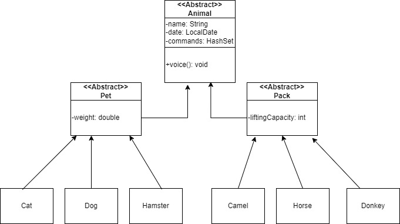
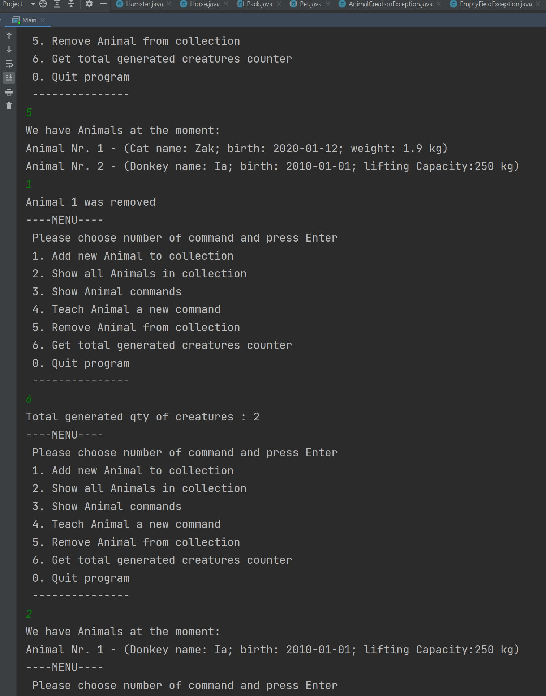
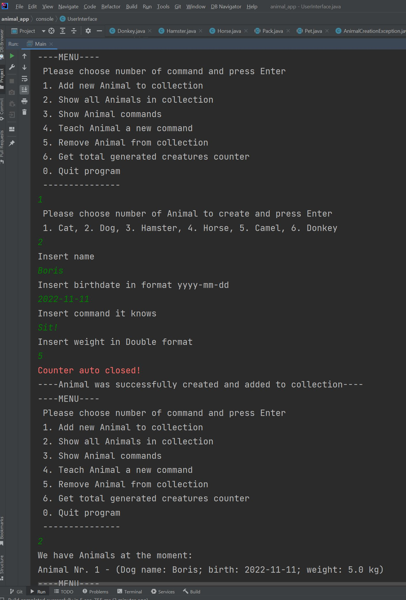
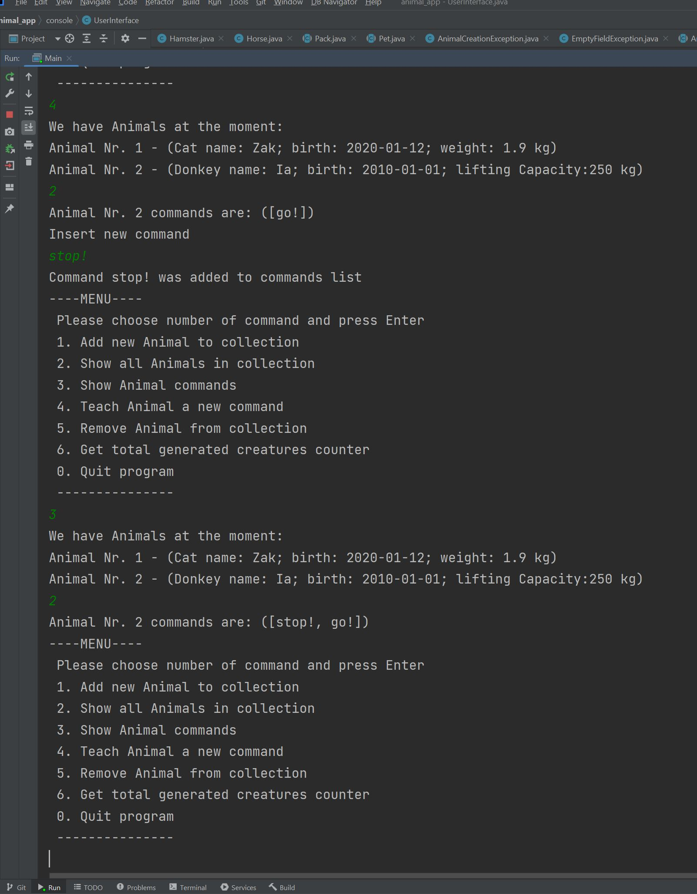
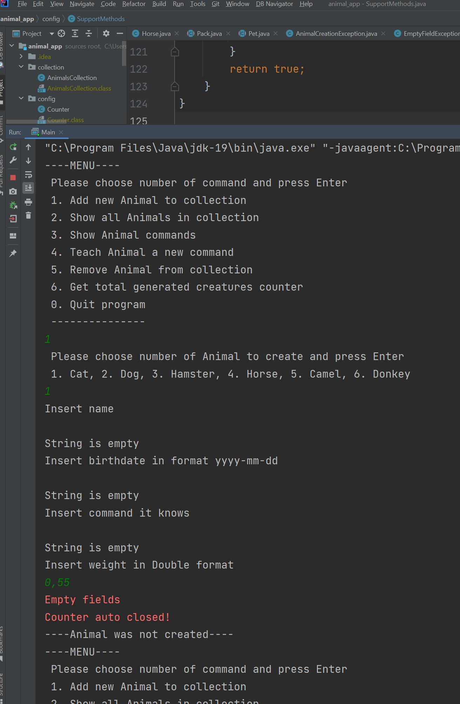

# animal_app - is a part of a Final test work.

**Пункты задание по написанию приложения :**

13.Создать класс с Инкапсуляцией методов и наследованием по диаграмме.

В программе имеется абстрактный класс Animal, от которого наследуются еще 2 абстрактных класса: Домашнее животное (Pet) 
с дополнительными свойством вес (weight) и Вьючное животное (Pack) с дополнительным свойством нагрузки (liftingCapacity).
Все действующие объекты наследуются от этих двух классов (Pet, Pack). У каждого типа конкретного животного 
переопределен метод voice() и toString() для индивидуальности.
Создана своя иерархия исключений для удобства выявления ошибок.
Программа разбита на блоки для удобства. Каждый блок отвечает за свою логику. 

14.Написать программу, имитирующую работу реестра домашних животных.

Программа позволяет создавать животное. Животное будет создано только при условии правильного заполнения всех 
запрашиваемых полей. После cоздания, объект помещается в коллекцию (ArrayList) типа Animal. 
Есть функционал просмотра всех созданных животных с их основными данными, кроме команд. 
Также животное можно удалить из коллекции, выбрав из списка имеющихся.

В программе должен быть реализован следующий функционал:

14.1 Завести новое животное

Животное заводится посредством выбора вариантов из меню из доступных вариантов.

14.2 определять животное в правильный класс

В зависимости от выбора создается объект необходимого класса.

14.3 увидеть список команд, которое выполняет животное

14.4 обучить животное новым командам

Список команд можно запросить отдельно по конкретному животному.
Команды животного хранятся в коллекции HashSet. Повторяющиеся команды (в данном случае одинаково написанные) 
добавляться не будут.

14.5 Реализовать навигацию по меню

15.Создайте класс Счетчик, у которого есть метод add(), увеличивающий̆
значение внутренней̆ int переменной̆на 1 при нажатие “Завести новое
животное” Сделайте так, чтобы с объектом такого типа можно было работать в
блоке try-with-resources. Нужно бросить исключение, если работа с объектом
типа счетчик была не в ресурсном try и/или ресурс остался открыт. Значение
считать в ресурсе try, если при заведения животного заполнены все поля.

Для выполнения данного пункта, класс Counter включает в себя интерфейс AutoCloseable. При выполнении функционала 
добавления животного появляется информация об автоматическом закрытии ресурса и при срабатывании исключения, 
если не введены все данные. В таком случае внутренняя переменная счетчика не увеличивается.

